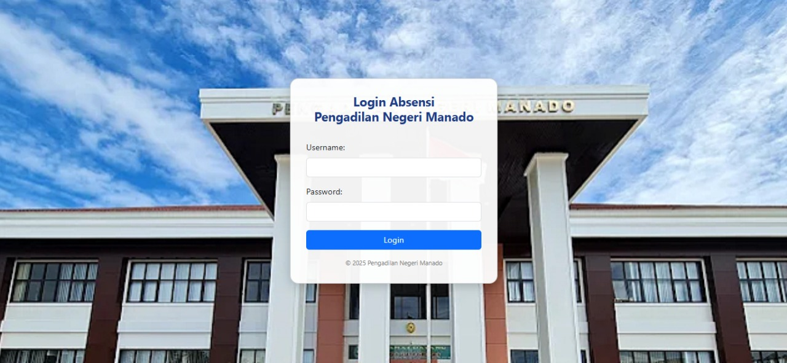

<h1 align="center">
  
</h1>

<!-- Foto Pribadi dengan Efek -->

  

  <b>Laravel Enthusiast & Web Developer | Polytechnic Student</b> 
  <a href="https://github.com/agil-afk/website-caffee" target="_blank">
    🚀 Website Caffee Preview
  </a>

---

## 👋 Tentang Saya

Halo! Saya **Agil Kantu**, seorang mahasiswa politeknik yang sedang fokus mempelajari dan mengembangkan aplikasi web menggunakan **Laravel**.  
Saat ini saya sedang membuat sebuah **website café** sebagai bagian dari portofolio pengembangan web saya.

---

## 🛠️ Tools & Technologies

  

---

## 🌟 Proyek Unggulan

<table>
  <tr>
    <td></td>
    <td></td>
  </tr>
</table>

---

## 🏆 Sertifikat & Penghargaan

- 🥇 [Digitalent: Belajar Dasar Pemrograman Web](https://mapi.sdmdigital.id/get-file?path=output_signed/193-733-7982/d70b1ed9-c614-4e46-9ecc-732e7d1f359e.pdf&disk=dts-storage-sertifikat)
- 🏅 [FreeCodeCamp: Responsive Web Design](https://www.freecodecamp.org/certification/Agil_Kantu/responsive-web-design)

---

## 📈 GitHub Stats & Activity

  
   
  

---

## 📊 Aktivitas Coding

---

## ☕ Mau Ngobrol?

- 📷 Instagram: [@agilkantuu](https://www.instagram.com/agilkantuu?igsh=MXEwbjFtZDk3YTVhMg%3D%3D&utm_source=qr)
- 🌐 Website: [https://github.com/agil-afk](https://github.com/agil-afk)

  

<!-- CSS Animasi -->

